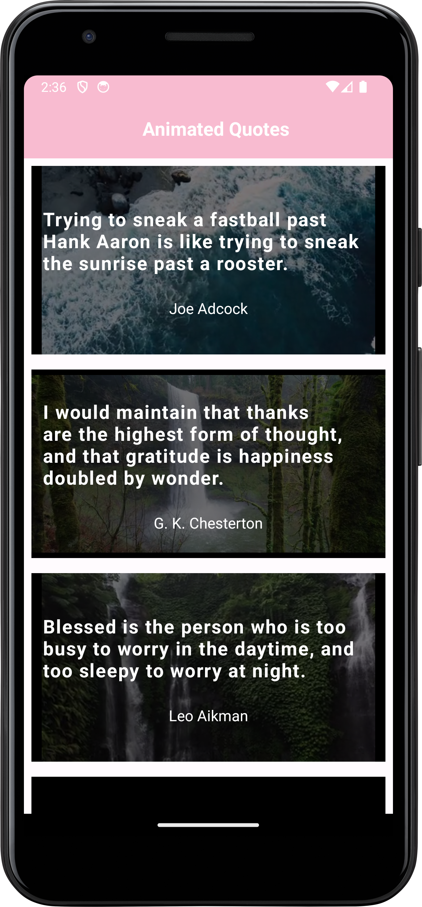

# AnimatedQuotes

AnimatedQuotes is an innovative Android application that delivers inspiring quotes paired with dynamic video backgrounds. The app retrieves quote data from a Quotes API and video content from the Pexels API, creating a multimedia experience designed to inspire. Built with Kotlin using Android Studio, AnimatedQuotes follows the MVVM architectural pattern and leverages Android Jetpack components such as Retrofit, LiveData, and Data Binding.

## Table of Contents

- [Overview](#overview)
- [Features](#features)
- [Tech Stack](#tech-stack)
- [Architecture](#architecture)
- [API Integrations](#api-integrations)
- [Testing](#testing)
- [Continuous Integration](#continuous-integration)
- [Screenshots](#screenshots)
- [Contributing](#contributing)
- [License](#license)
- [Contact](#contact)

## Overview

AnimatedQuotes is designed to provide users with a unique, multimedia inspirational experience. The app fetches motivational quotes from a dedicated Quotes API and pairs them with engaging video content from the Pexels API. With a clean MVVM structure, the application separates the UI, business logic, and data layers—ensuring maintainability and smooth, reactive user experiences.

## Features

- **Dynamic Inspirational Quotes:**  
  Retrieve and display motivational quotes from a Quotes API.

- **Engaging Video Backgrounds:**  
  Fetch high-quality video content from the Pexels API to complement the quotes.

- **MVVM Architecture:**  
  Cleanly separates the UI, business logic, and data layers for enhanced maintainability and testability.

- **Reactive UI:**  
  LiveData ensures that any changes in the data are automatically reflected in the UI.

- **Efficient Data Binding:**  
  Uses Data Binding to reduce boilerplate and keep the UI code clean and maintainable.

- **Comprehensive Testing:**  
  The project includes unit tests, integration tests, and Espresso UI tests to ensure functionality and reliability.

## Tech Stack

- **Language:** Kotlin
- **Architecture:** MVVM
- **Networking:** Retrofit (for Quotes API and Pexels API)
- **UI Components:** LiveData, Data Binding, ConstraintLayout, Material Design
- **Testing:**
  - *Unit Testing:* JUnit, Mockito/MockK
  - *Integration Testing:* AndroidX Test framework
  - *UI Testing:* Espresso
- **Build Tool:** Gradle
- **Continuous Integration:** GitHub Actions

## Architecture

The app is organized using the Model-View-ViewModel (MVVM) pattern:

- **Model:**  
  Contains data classes representing quotes and video details, along with API response objects.

- **ViewModel:**  
  Exposes LiveData streams to the UI and contains the business logic. It interacts with the Repository to fetch data.

- **View:**  
  Consists of Activities and Fragments that bind to the ViewModel using Data Binding, ensuring reactive updates to the UI.

- **Repository:**  
  Manages data operations by retrieving data from remote sources (Quotes API and Pexels API) via Retrofit, and handles any local caching if needed.

## API Integrations

- **Quotes API:**  
  Provides inspiring quotes in various categories. AnimatedQuotes fetches, parses, and displays these quotes to uplift users.

- **Pexels API:**  
  Supplies high-quality video content that serves as vivid, engaging backgrounds for the quotes.

## Testing

AnimatedQuotes is fully covered by a comprehensive suite of tests:

- **Unit Testing:**  
  Verifies the logic in ViewModels and Repository methods using JUnit and Mockito/MockK.
  ```bash
  ./gradlew testDebugUnitTest
  
- **Integration Testing:**
Confirms that different components (e.g., ViewModel and Repository) interact seamlessly.
  ```bash
./gradlew connectedDebugAndroidTest

- **Espresso UI Testing:**
 Automates UI tests to ensure the app’s user interactions perform as expected.
  ```bash
./gradlew connectedAndroidTest
(Ensure that an Android emulator or device is connected before running these commands.)

- **Continuous Integration:**
A Continuous Integration (CI) workflow is included using GitHub Actions. The CI configuration, located at .github/workflows/ci.yml, automatically runs all tests (unit, integration, and Espresso UI) on every commit or pull request. This ensures that code quality remains high and that any new changes do not break existing functionality.

- **Screenshots:**
Here are some screenshots of AnimatedQuotes:

<div align="center"> 

- **License:**
This project is licensed under the MIT License. See the LICENSE file for details.

- **Contact:**
Developer: Your Name Email: maha21.kanagaraj@gmail.com GitHub: github.com/maha-lakshme
